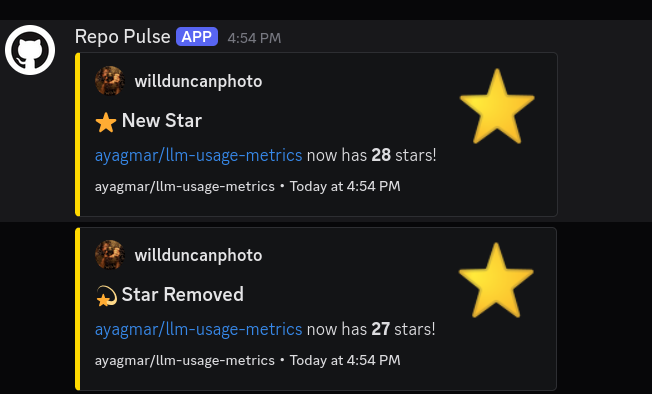

# Repo Pulse

<div align="center">
  
</div>

<div align="center">

[](https://github.com/ayagmar/repo-pulse/actions/workflows/ci.yml)
[](https://codecov.io/gh/ayagmar/repo-pulse)
[](./LICENSE)
[](./package.json)
[](https://workers.cloudflare.com/)
[](https://hono.dev/)
[](https://developers.cloudflare.com/d1/)
[](./tsconfig.json)
[](https://deepwiki.com/ayagmar/repo-pulse)


</div>

Repo Pulse is a Cloudflare Workers service for GitHub repository activity. It verifies raw webhook signatures, normalizes supported events into a strict internal model, persists accepted deliveries in D1, deduplicates on GitHub delivery ID, and dispatches Discord notifications asynchronously.

## Why it exists

GitHub webhooks are easy to receive and easy to mishandle. Repo Pulse is built around the parts that usually break first in production:

- exact raw-body HMAC verification
- persist-before-accept durability
- duplicate delivery protection
- asynchronous notification dispatch
- retryable delivery ledger with attempt history
- authenticated admin endpoints for status, health, replay, and docs

## What the service does

```text
GitHub webhook -> verify signature -> map RepoEvent -> persist in D1 -> return 202 -> notify Discord -> retry if needed
```

<div align="center">
  
</div>

## UI preview

<div align="center">
  
</div>

### Core behavior

- `POST /webhook` receives GitHub webhook deliveries
- verifies `X-Hub-Signature-256` against the exact raw body
- enforces request body size before JSON parsing
- normalizes supported payloads into one `RepoEvent` union
- writes accepted work to D1 before returning `202 Accepted`
- deduplicates using the GitHub delivery ID
- dispatches Discord notifications asynchronously with `waitUntil()`
- recovers retries and stale processing via cron-backed drains

## Supported events

| GitHub event | Internal event types |
| --- | --- |
| Stars | `star.created`, `star.deleted` |
| Issues | `issue.opened`, `issue.closed`, `issue.reopened` |
| Pull requests | `pull_request.opened`, `pull_request.closed`, `pull_request.merged`, `pull_request.reopened` |
| Forks | `fork.created` |

Unsupported events are acknowledged and ignored.

## API surface

### Public route

| Method | Path | Purpose |
| --- | --- | --- |
| `POST` | `/webhook` | GitHub webhook ingestion and acceptance |

### Admin routes

All admin routes require:

```http
Authorization: Bearer <ADMIN_API_TOKEN>
```

| Method | Path | Purpose |
| --- | --- | --- |
| `GET` | `/admin/health` | lightweight operational health |
| `GET` | `/admin/status` | service status plus ledger stats |
| `GET` | `/admin/deliveries` | list persisted deliveries |
| `GET` | `/admin/deliveries/:deliveryId` | inspect one delivery and attempts |
| `POST` | `/admin/deliveries/:deliveryId/retry` | retry a failed delivery |
| `GET` | `/admin/openapi.json` | authenticated OpenAPI document |
| `GET` | `/admin/docs` | authenticated Swagger UI |

## Metrics and operational numbers

Repo Pulse exposes delivery-ledger metrics directly from the admin surface.

### Delivery ledger metrics

Returned from `GET /admin/status`:

| Metric | Meaning |
| --- | --- |
| `total` | total tracked deliveries |
| `pending` | queued and waiting to be processed |
| `processing` | currently leased by a worker |
| `failed` | terminal failures after retry policy |
| `succeeded` | successfully delivered notifications |

Returned from `GET /admin/health`:

| Field | Meaning |
| --- | --- |
| `status` | current service health indicator |
| `providers` | configured notifier names |
| `trackedDeliveries` | current delivery count in the ledger |

### Runtime defaults

These defaults are committed in `wrangler.jsonc` and `src/config/delivery-policy.ts`:

| Setting | Value |
| --- | --- |
| Webhook max body | `1,048,576` bytes |
| Max delivery attempts | `5` |
| Retry base delay | `30s` |
| Retry max delay | `15m` |
| Succeeded retention | `14 days` |
| Processing lease | `5m` |
| Drain batch size | `25` |
| Cron cadence | every minute |

## Architecture in one screen

- **Edge route:** reads the raw request stream and validates the GitHub signature
- **Event mapping:** converts inbound payloads into strict domain events
- **D1 ledger:** stores accepted deliveries, dedupe state, attempts, and retry metadata
- **Background processor:** drains due work, dispatches providers, reschedules transient failures, and prunes old succeeded rows
- **Admin surface:** exposes status, health, delivery history, retries, OpenAPI, and Swagger UI

Related docs:

- [Architecture summary](ARCHITECTURE.md)
- [System design](docs/system-design.md)
- [Setup guide](SETUP.md)
- [Operations guide](docs/operations.md)

## Quick start

### 1. Install

```bash
npm ci
```

### 2. Create local secrets

```bash
cp .dev.vars.example .dev.vars
```

### 3. Apply local migrations and generate types

```bash
npm run db:migrate:local
npm run typegen
```

### 4. Start the Worker

```bash
npm run dev
```

Wrangler serves the app on `http://127.0.0.1:8787` by default.

## Deploy

### Required secrets

```bash
npm exec wrangler secret put GITHUB_WEBHOOK_SECRET
npm exec wrangler secret put ADMIN_API_TOKEN
npm exec wrangler secret put DISCORD_WEBHOOK_URL
```

### Remote migration and deploy

```bash
npm run db:migrate:remote
npm run deploy
```

### GitHub webhook configuration

Use this endpoint:

```text
https://<your-worker>.workers.dev/webhook
```

Use these GitHub webhook settings:

- content type: `application/json`
- secret: same value as `GITHUB_WEBHOOK_SECRET`
- events: `Stars`, `Issues`, `Pull requests`, `Forks`

## Tooling

- Runtime: Cloudflare Workers
- Framework: Hono
- Durable storage: D1
- Language: TypeScript
- Package manager workflow: npm
- Local platform tooling: Wrangler
- Verification: Vitest, ESLint, Biome, Knip

## Verification commands

```bash
npm run typegen
npm run typecheck
npm run lint
npm run check:ci
npm run test
npm run knip
npm run build
```

## Guarantees

- supported deliveries are persisted before `POST /webhook` returns `202 Accepted`
- duplicate delivery IDs return `200` and do not resend notifications
- notification dispatch is asynchronous and recoverable
- retries and stale-processing recovery are driven from D1 state plus cron
- admin routes stay protected by bearer auth

## Repo navigation

```text
src/http/routes/webhook.ts      webhook ingestion
src/http/routes/admin.ts        admin API surface
src/http/openapi.ts             OpenAPI document + Swagger UI page
src/core/services/d1-delivery-ledger.ts
src/core/services/durable-event-processor.ts
src/providers/github/           payload verification + event mapping
src/providers/discord/          embed formatting + delivery transport
```
