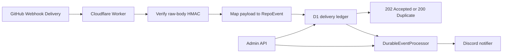
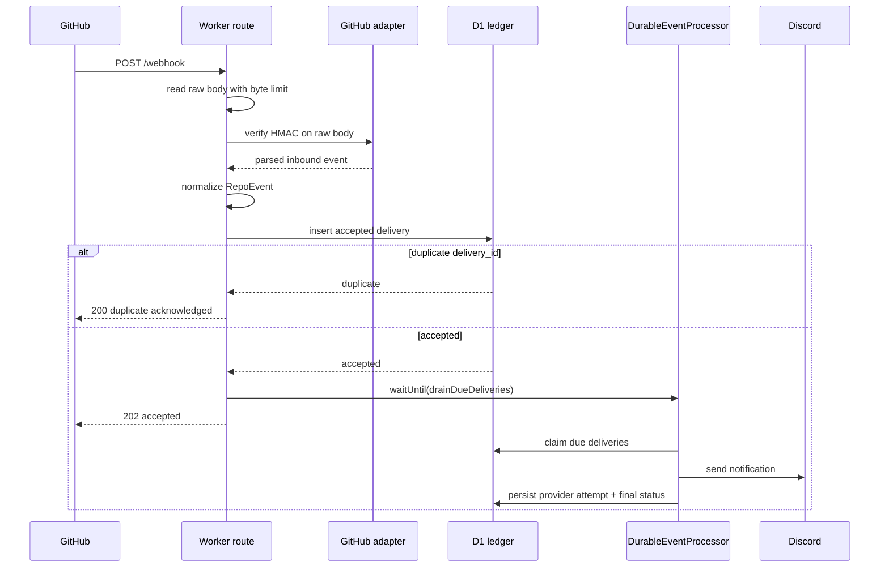
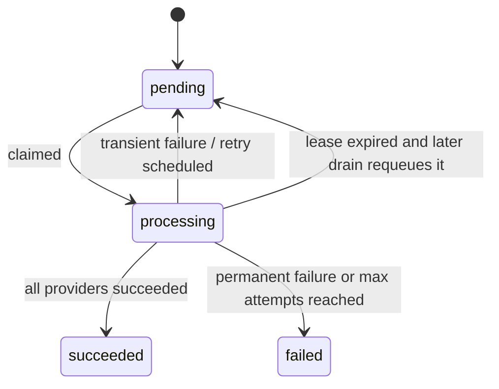

# System Design

## Overview

Repo Pulse is a webhook ingestion and notification pipeline built for Cloudflare Workers. It accepts GitHub deliveries, verifies the exact request body with HMAC, maps supported events into a strict domain union, stores accepted work in D1, and dispatches provider notifications asynchronously.

## High-Level Design

## Webhook Request Flow

## Delivery Lifecycle

## Components

### Webhook edge

- Reads the raw request stream directly so HMAC verification matches GitHub’s original bytes.
- Rejects oversized requests before JSON parsing.
- Rejects unsupported or invalid payloads with standardized JSON errors.

### Domain mapping

- `providers/github/` normalizes GitHub payloads into strict `RepoEvent` variants.
- Unsupported events are acknowledged without entering the notification pipeline.

### Durable ledger

- D1 is the canonical persistence boundary.
- `delivery_id` is the dedupe key.
- Delivery rows store normalized event payload, status, attempt counters, retry timing, lease metadata, and latest failure context.
- Provider attempt rows preserve historical send attempts per delivery and provider.

### Background processor

- Claims due rows from D1 in batches.
- Persists `processing` leases to recover from interrupted invocations.
- Reschedules transient failures with backoff.
- Prunes succeeded deliveries based on retention policy.

### Admin surface

- Protected by `Authorization: Bearer <ADMIN_API_TOKEN>`.
- Lists deliveries, shows details, retries eligible failures, exposes OpenAPI, and serves Swagger UI.

## Why This Shape

- Workers do not offer an always-on process, so the design moves durability into D1 instead of memory.
- `waitUntil()` gives fast follow-up execution after acceptance, while the cron trigger guarantees retries and stale-lease recovery continue even without steady inbound traffic.
- The route writes accepted work before success to preserve the original service’s durability semantics as closely as Workers allows.

## Constraints

- Retry execution is durable, but exact execution time is bounded by cron cadence and Worker scheduling.
- Notification dispatch is asynchronous; `202 Accepted` means persisted and queued, not fully delivered.
- Runtime code avoids filesystem-only and non-Workers APIs. Test code may use local SQLite only as a D1-compatible harness.
